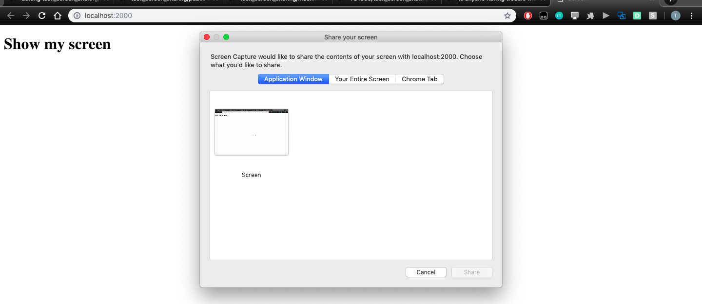

# task_screen_sharing
1)<code>git clone https://github.com/TG1999/task_screen_sharing.git</code> 
2)<h3>Install extensions in chrome </h3>
open <code>chrome://extensions</code>in google chrome
Then tick the developer option at top right corner.
Select load Unpacked at top left corner
Then select the extension folder from task_screen_sharing
After that there will be an extension downloaded Screen Capture with an ID like this:- 

3)Change extension id at line number 29 in <code>/public/index.html</code>  
4)<code>npm install</code> 
5)<code>npm start</code> 
6)Then open <code>localhost:2000(presenter)</code> 
7)Open <code>localhost:2000/client.html(reciever)</code> 
8)Start screen sharing from presenter tab 
<h2>NOTE:- SETUP BOTH PRESENTER AND RECIEVER BEFORE START SCREEN SHARING JUST LIKE HANGOUTS BOTH MUST BE PRESENT BEFORE SCREEN SHARING</h2>
9)Select Application Window(Only Google Chrome),Your entire screen(Every Application of laptop),Chrome Tab(only that particular tab) 

10)Select any Screen then click Share 
